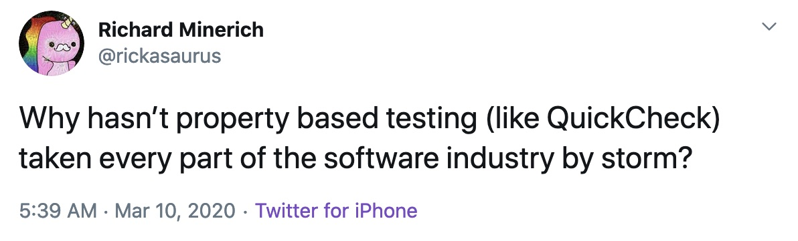

Property based testing, or generative testing, if you prefer, is quite popular in the functional programming world, but less so elsewhere. As Richard Minerich put it, on Twitter, earlier this year:



There are quite a few articles on the interwebz that cover what property based testing is with some basic examples, this post serves to add to their numbers but, hopefully, goes a bit further with a "real world" example from something I worked on recently.

I'm going to make the assumption that if you're reading this, you are already familiar with unit testing; writing tests that exercise code to make sure it does what it should. However, as Djikstra said:

> [T]esting is hopelessly inadequate...
> [It] can be used very effectively to show the presence of bugs but never to show their absence.”

The problems with testing are talked about at length in the classic paper Out Of The Tarpit:

> The key problem with testing is that a test (of any kind) that uses one particular set of inputs tells you nothing at all about the behaviour of the system or component when it is given a different set of inputs. The huge number of different possible inputs usually rules out the possibility of testing them all, hence the unavoidable concern with testing will always be — have you performed the right tests?.

Even in the case where do handle all of the scenarios, we can end up with more lines of test code than we have of actual, production, code. This is the problem that property based testing seeks to help with.

## What Is Property Based Testing

The basic idea of property based testing is this: you come up with a property, or properties, that a function holds,
then let the library generate random values and call the function. This process, calling a function with random
values happens multiple times, typically the default is 100, ensures that the property defined holds for all calls.
If it doesn't, the library "shrinks" the failure down to it's smallest form; a single test run that fails to satify
that property.

The idea orginated in Haskell in 1999 with the library QuickCheck and now has implementations in a slew of languages; including the language that will be used in this post: JavaScript.

## Defining Properties

If we think back to basic arithematic, we remember that addition has the propertiest of identity, commutativity and associativty.

#### Identity Property

When zero is added to any number, the result is the same as that number.

``` bash
λ node
> 1 + 0 === 1
true
```

#### Commutative Property

When numbers are added, the result is the same no matter their order.

``` bash
λ node
> 3 + 2 === 2 + 3
true
```

#### Associative Property

When numbers are added, the result is the same no matter how they are parenthesized.

``` bash
λ node
> (1 + 2) + 3 === 1 + (2 + 3)
true
```

Multiplication also has these properties, and one other:

#### Distributive Property

When two numbers are added and multiplied by a third, the result is the same if we multiple the first two numbers with the
third separately and then add the results together.

``` bash
λ node
> (1 + 2) * 3 === (1 * 3) + (2 * 3)
true
```

So how do you test this? Each of these properties needs to hold true for all numbers. To be really confident that these
properties hold we would have to write A LOT of tests. This is where property based testing helps.

## Enter Fast-Check

JavaScript has quite a few property based testing libraries, but I found `fast-check` to have the combination of an API
that I liked (looking at you `JSVerify`) and was still maintained (looking at you `TestCheck.js`).

So, given that we've settled on using `fast-check` how would go about testing the properties above?

#### Identity

``` javascript
// Addition
const prop = fc.property(fc.integer(), fc.constant(0), (a, b) => a + b === a)

fc.check(prop)
```

``` javascript
// Multiplication
const prop = fc.property(fc.integer(), fc.constant(1), (a, b) => a * b === a)

fc.check(prop)
```

In each case we start by defining a property using the `property` function. We provide three arguments, this first tells
`fast-check` to provide any arbitrary integer at each run, the second tells `fast-check` to provide a constant value. The final argument is a function that takes the values that `fast-check` provides. The two tests above are very
similar but differ a bit because the identity for multipilcation is 1 where as it is 0 for addition, and, of course, the
operators are different.

The output for each is similar, only differing in the `seed` value.

``` javascript
{
  failed: false,
  interrupted: false,
  numRuns: 100,
  numSkips: 0,
  numShrinks: 0,
  seed: 1512098030,
  counterexample: null,
  counterexamplePath: null,
  error: null,
  failures: [],
  executionSummary: [],
  verbose: 0
}
```

From the result we can see that 100 tests were run and none of them failed. We can have `fast-check` execute the test
a different number of times by passing in a `numRuns` value.

``` javascript
// Addition
const prop = fc.property(fc.integer(), fc.constant(0), (a, b) => a + b === a
)

fc.check(prop, {numRuns: 1000}) // run 1000 times
```

What about failures? Here is a busted identity test:

``` javascript
// Addition
const prop = fc.property(fc.integer(), fc.constant(20), (a, b) => a + b === a)

fc.check(prop)
```

Here is the result:

``` javascript
{
  failed: true,
  interrupted: false,
  numRuns: 1,
  numSkips: 0,
  numShrinks: 1,
  seed: 443876455,
  counterexample: [ 0, 20 ],
  counterexamplePath: '0:0',
  error: 'Property failed by returning false',
  failures: [],
  executionSummary: [],
  verbose: 0
}
```

Here we can see that the test failed after one run and `fast-check` provides a counter example telling us that if 0 and 20
are added together the answer will not match our property. We expected any integer (`a`) plus `20` to equal `a` and that
fails right away.

Fast-check has a lot of what are called 'arbitraries', functions like `fc.integer` and `fc.constant`, that generate arbiraty
values for each test run. These are just a few examples.

These examples are pretty basic and defining properties can be difficult, particularly if we try to ascertain what mathmatical properties
our function upholds. What if it doesn't have any?

### A More Real World Example

Likely, there is some sort of property that you function holds. In this case, taken from something I worked recently, that property
was the validity of an object and it's properties.

Let's say we have a `options` argument that we pass to a function that validates the options before doing any further processing. We
can use a library like `joi` to specify the properties of out `options` object and then validate that.

``` javascript
const defaultOptions = {
	foo: false,
	bar: false,
	baz: false,
	qux: false
}

const optionsSchema = Joi.object({
	foo: Joi.boolean().default(false),
	bar: Joi.boolean().default(false),
	baz: Joi.boolean().default(false),
	qux: Joi.boolean().default(false)
}).default(defaultOptions) // just in case the caller decides not to send anything
```